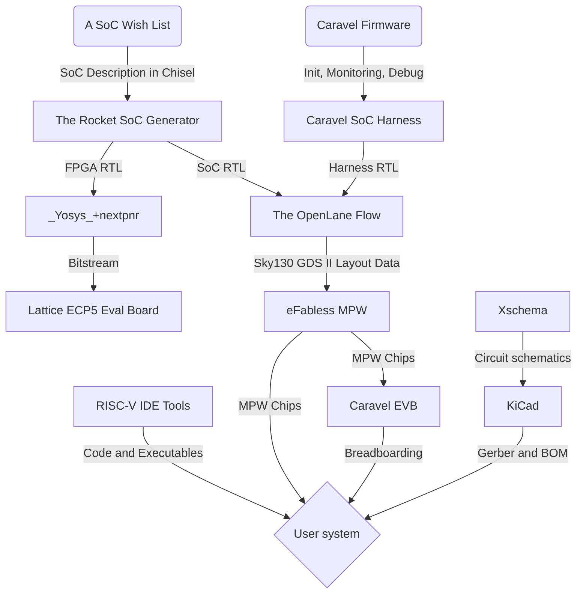
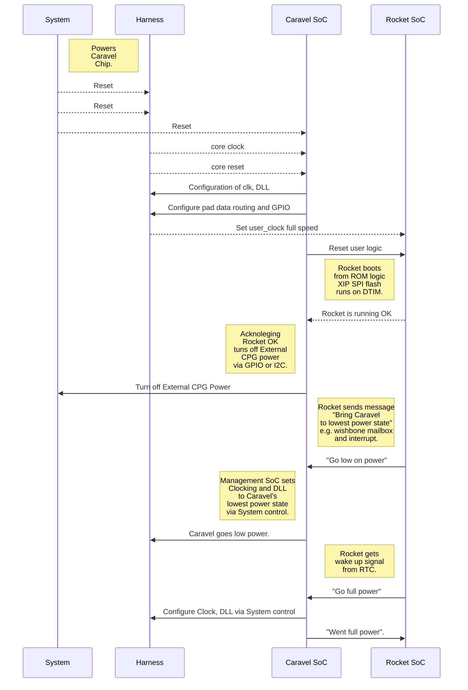

# Marmot RISC-V SoC 

## A Customizable RISC-V Microcomputer
A custom microcomputer design is useful when off-the-shelf general-purpose microcontrollers fail to meet the system needs. The rocket SoC generator automatically generate an SoC. It circumvents labor-intensive, error-prone, top-level SoC design.

## SoC Customization Flow
The Rocket SoC Generator and Caravel SoC Template are reused to create a twin (not identical) RISC-V SoC consisting of one Rocket RISC-V and one Caravel RISC-V. The objectives here is to save hours on design verification and reduce power consumption rather than saving die area or chip cost. 

##  Implementing low power operations
The following shows a scheme to manage clock, reset, power and low power state.

## Peripheral Overviews
|Peripheral|Units | Pins / unit | Total pins | Muxed with GPIO | Note
|-------|-------|-------|-------|------|------|
|Clock|1|1|0|-|From mgmt.SoC
|Reset|1|1|0|-|From mgmt.SoC
|QSPI 0 (XIP)|1|6|6|No|For Flash
|QSPI 1 (no XIP)|1|7|7|Yes|For ADC, etc. (CS x2)
|QSPI 2 (no XIP)|1|6|6|Yes|For PSRAM (no time to support XIP)
|UART 0|1|2|2|No	
|UART 1-4|4|2|8|Yes	
|I2C 0-1|2|2|4|Yes	
|JTAG|1|4|4|No	
|Total|||37||Max. 38

## Pinouts
Caravel mprj_io[#]|Caravel Mgmt. SoC|Rocket (Marmot) IOF0|Rocket (Marmot) GPIO
|-------|-------|-------|-------|
0|JTAG|-|-
1|SDO|TDO|-
2|SDI|TDI|-
3|CSB|TMS|-
4|SCK|TCK|-
5|ser_rx|uart0_rx|-
6|ser_tx|uart0_tx|-
7|irq|spi1_csb[1]|gpio[24]
8|flash2_csb|spi0_flash_csb|-
9|flash2_sck|spi0_flash_sck|-
10|flash2_io[0]|spi0_flash_io[0]|-
11|flash2_io[1]|spi0_flash_io[1]|-
12|-|spi0_flash_io[2]|-
13|-|spi0_flash_io[3]|-
14|-|spi1_csb[0]|gpio[0]
15|-|spi1_sck|gpio[1]
16|-|spi1_io[0]|gpio[2]
17|-|spi1_io[1]|gpio[3]
18|-|spi1_io[2]|gpio[4]
19|-|spi1_io[3]|gpio[5]
20|-|spi2_csb|gpio[6]
21|-|spi2_sck|gpio[7]
22|-|spi2_io[0]|gpio[8]
23|-|spi2_io[1]|gpio[9]
24|-|spi2_io[2]|gpio[10]
25|-|spi2_io[3]|gpio[11]
26|-|i2c0_sda|gpio[12]
27|-|i2c0_scl|gpio[13]
28|-|i2c1_sda|gpio[14]
29|-|i2c1_scl|gpio[15]
30|-|uart1_rx|gpio[16]
31|-|uart1_tx|gpio[17]
32|-|uart2_rx|gpio[18]
33|-|uart2_tx|gpio[19]
34|-|uart3_rx|gpio[20]
35|-|uart3_tx|gpio[21]
36|-|uart4_rx|gpio[22]
37|-|uart4_tx|gpio[23]

## Address Map
Base|Top|Attribute|Description|Notes
|-------|-------|-------|-------|-------|
0x0000_0000|0x0000_0FFF|RWX A|Debug|Debug Address Space
0x0000_1000|0x0000_2FFF||Reserved|On-Chip Non Volatile Memory
0x0000_3000|0x0000_3FFF|RWX A|Error Device|On-Chip Non Volatile Memory
0x0000_4000|0x0000_FFFF||Reserved|On-Chip Non Volatile Memory
0x0001_0000|0x0001_1FFF|R XC|Mask ROM (8 KiB)|On-Chip Non Volatile Memory
0x0001_2000|0x0002_1FFF||Reserved|On-Chip Non Volatile Memory
0x0200_0000|0x0200_FFFF|RW A|CLINT|On-Chip Peripherals
0x0201_0000|0x07FF_FFFF||Reserved|On-Chip Peripherals
0x0800_0000|0x0800_1FFF|RWX A|ITIM (8 KiB)[^1]|On-Chip Volatile Memory
0x0800_2000|0x0BFF_FFFF|Reserved|On-Chip Volatile Memory
0x0C00_0000|0x0FFF_FFFF|RW A|PLIC|On-Chip Peripherals
0x1000_0000|0x1000_0FFF|RW A|AON|On-Chip Peripherals
0x1000_1000|0x1001_1FFF||Reserved|On-Chip Peripherals
0x1001_2000|0x1001_2FFF|RW A|GPlO|On-Chip Peripherals
0x1001_3000|0x1001_3FFF|RW A|UART 0|On-Chip Peripherals
0x1001_4000|0x1001_4FFF|RW A|QSPI 0|On-Chip Peripherals
0x1001_5000|0x1001_5FFF||Reserved|On-Chip Peripherals
0x1001_6000|0x1001_6FFF|RW A|I2C 0|On-Chip Peripherals
0x1001_7000|0x1002_2FFF||Reserved|On-Chip Peripherals
0x1002_3000|0x1002_3FFF|RW A|UART 1|On-Chip Peripherals
0x1002_4000|0x1002_4FFF|RW A|QSPI 1|On-Chip Peripherals
0x1002_5000|0x1002_5FFF||Reserved|On-Chip Peripherals
0x1002_6000|0x1002_6FFF|RW A|I2C 1|On-Chip Peripherals
0x1002_7000|0x1003_2FFF||Reserved|On-Chip Peripherals
0x1003_3000|0x1003_3FFF|RW A|UART 2|On-Chip Peripherals
0x1003_4000|0x1003_4FFF|RW A|QSPI 2|On-Chip Peripherals
0x1003_5000|0x1FFF_FFFF||Reserved|On-Chip Peripherals
0x1004_3000|0x1005_2FFF|RW A|UART3|On-Chip Peripherals
0x1004_4000|0x1005_2FFF||Reserved|On-Chip Peripherals
0x1005_3000|0x1005_3FFF|RW A|UART 4|On-Chip Peripherals
0x1005_4000|0x1FFF_FFFF||Reserved|On-Chip Peripherals
0x2000_0000|0x3FFF_FFFF|R XC|QSPI 0 Flash (512 MiB)|Off-Chip Non-Volatile Memory
0x4000_0000|0x7FFF_FFFF||Reserved|Off-Chip Non-Volatile Memory
0x8000_0000|0x8000_3FFF|RWX A|DTIM (16 KiB)[^1]|On-Chip Volatile Memory
0x8000_4000|0xFFFF_FFFF||Reserved|On-Chip Volatile Memory

[^1]: Memory size may be reduced due to chip size limitation.

## Reference

Freedom E300 Arty FPGA Dev Kit
https://github.com/sifive/freedom#freedom-e300-arty-fpga-dev-kit

Krste Asanović, Rimas Avižienis, Jonathan Bachrach, Scott Beamer, David Biancolin, Christopher Celio, Henry Cook, Palmer Dabbelt, John Hauser, Adam Izraelevitz, Sagar Karandikar, Benjamin Keller, Donggyu Kim, John Koenig, Yunsup Lee, Eric Love, Martin Maas, Albert Magyar, Howard Mao, Miquel Moreto, Albert Ou, David Patterson, Brian Richards, Colin Schmidt, Stephen Twigg, Huy Vo, and Andrew Waterman, _[The Rocket Chip Generator](http://www.eecs.berkeley.edu/Pubs/TechRpts/2016/EECS-2016-17.html)_, Technical Report UCB/EECS-2016-17, EECS Department, University of California, Berkeley, April 2016

eFabless Caravel Architecture
https://caravel-harness.readthedocs.io/en/latest/getting-started.html

## Acknowledgements

This work is based on results obtained from project, JPNP16007, commissioned by The New Energy and Industrial Technology Development Organization (NEDO). 
